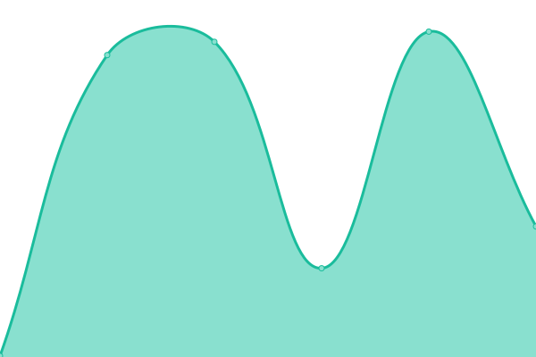
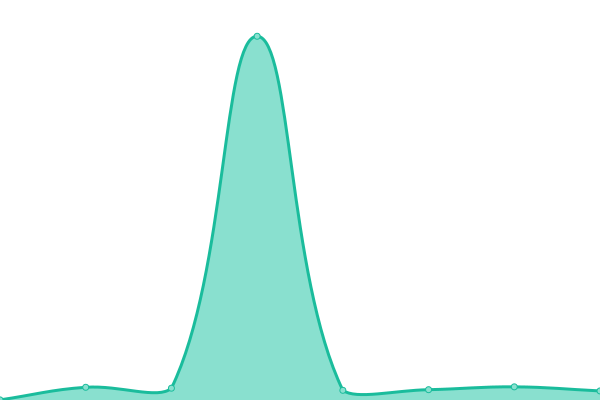
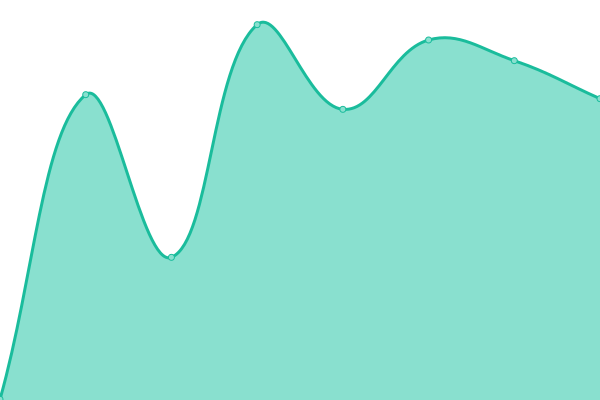

# [📈 Live Status](https://status.jatinp.com): <!--live status--> **🟧 Partial outage**

This repository contains the open-source uptime monitor and status page for [Jatin](jatinp.com), powered by [Upptime](https://github.com/upptime/upptime).

With [Upptime](https://upptime.js.org), you can get your own unlimited and free uptime monitor and status page, powered entirely by a GitHub repository. We use [Issues](https://github.com/jatin-p/portfolio-uptime/issues) as incident reports, [Actions](https://github.com/jatin-p/portfolio-uptime/actions) as uptime monitors, and [Pages](https://status.jatinp.com) for the status page.

<!--start: status pages-->
<!-- This summary is generated by Upptime (https://github.com/upptime/upptime) -->
<!-- Do not edit this manually, your changes will be overwritten -->
<!-- prettier-ignore -->
| URL | Status | History | Response Time | Uptime |
| --- | ------ | ------- | ------------- | ------ |
|  [Portfolio](https://www.jatinp.com) | 🟩 Up | [portfolio.yml](https://github.com/jatin-p/portfolio-uptime/commits/HEAD/history/portfolio.yml) | 

 120ms
     
 | 

<a href="https://status.jatinp.com/history/portfolio">100.00%</a>
    

|  [jpNotes](https://jpNotes.jatinp.com) | 🟩 Up | [jp-notes.yml](https://github.com/jatin-p/portfolio-uptime/commits/HEAD/history/jp-notes.yml) | 

 115ms
     
 | 

<a href="https://status.jatinp.com/history/jp-notes">100.00%</a>
    

|  [Lemmy](https://lemmy.pictures) | 🟥 Down | [lemmy.yml](https://github.com/jatin-p/portfolio-uptime/commits/HEAD/history/lemmy.yml) | 

 445ms
     
 | 

<a href="https://status.jatinp.com/history/lemmy">100.00%</a>
    

<!--end: status pages-->

[**Visit our status website →**](https://status.jatinp.com)

## 📄 License

- Powered by: [Upptime](https://github.com/upptime/upptime)
- Code: [MIT](./LICENSE) © [Jatin](jatinp.com)
- Data in the `./history` directory: [Open Database License](https://opendatacommons.org/licenses/odbl/1-0/)
